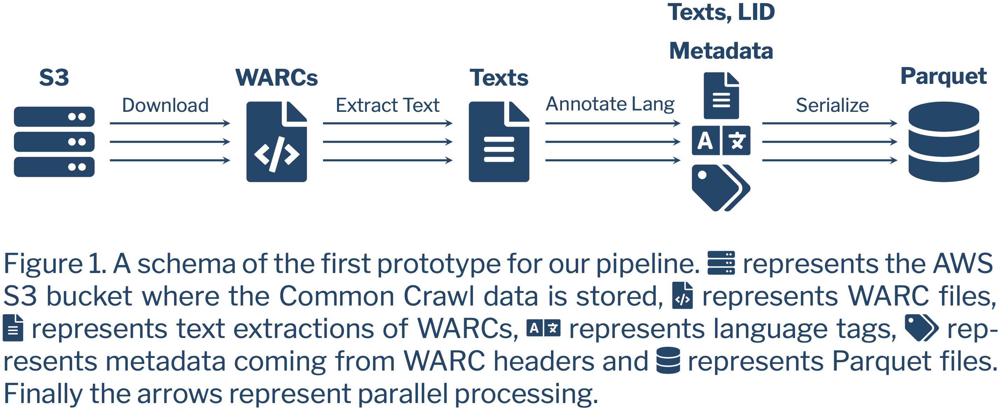

# Asynchronous and Modular Pipelines for Fast WARC Annotation

This repository contains a proof of concept for a modular and asynchronous pipeline for annotating WARC files. It is the supporting code for the WAC 2025 poster "Asynchronous and Modular Pipelines for Fast WARC Annotation".

## Abstract

Since the introduction of unsupervised and semi-supervised learning to Natural Language Processing (NLP) techniques, many advances have been made allowing researchers to annotate, classify and index large quantities of multilingual and heterogenous textual data. Moreover, the ever growing demand for data and compute in order to satisfy the needs of modern day Large Language Models (LLMs), has made some of the initial smaller models more widely available and cost-effective to use, allowing more researchers with smaller infrastructures to access them. Furthermore, given that most of the modern LLMs and unsupervised models in NLP are actually developed by pre-training them on large quantities of textual web data, has led NLP researchers to develop pipelines to annotate, filter and select data from WARC and ARC files in order to extract "relevant" web documents and use them in LLM training. And while the final goal of these pipelines is to produce data to train large models, they have effectively become compelling tools to explore, annotate and analyze large web corpora by directly processing the raw data instead of working at the metadata level.

However, even though some private companies have made some efforts to develop and maintain these pipelines such as Nemo Curator from NVIDIA or Datatrove by Hugging Face, most of them have been developed as part of research projects that are not maintained long-term or have been kept secret in order to obscure the pre-training step of LLMs training due to political, legal or commercial reasons. 

On the other hand, the web archiving community has developed their own software to process and analyze WARC files through the years such as, Archives Research Compute Hub (ARCH), The Archives Unleashed Toolkit or ArchiveSpark, and while most of the are well maintained they have focused on integrating more classical analysis or annotation tools, and have been optimized to act on the metadata, rather than on the raw content itself. 

We thus inspire ourselves on existing pipelines already developed by both the NLP and the web archiving communities and develop our own modular pipeline for WARC annotation. The first experimental version of our pipeline aims to be efficient so that it runs on constrained infrastructures, modular so that practitioners can develop and attach custom annotators, open-source so that we can foster a community that would continue to maintain it, and user-friendly so that little knowledge of large-scale data processing engines is needed. With the first version of this pipeline we want to bring some of the tools and techniques from the NLP community to the web-archiving one, hoping that both communities can benefit from it and use it to better categorize, annotate, filter and finally explore their existing web datasets.

## Notes and Work in Progress

- We build our prototype using `Rust`
  - Making the pipeline fast and memory-safe while allowing true parallelism
  - Allowing us to distribute dependency-free binaries for all major platforms
  - Making it possible to easily port code from existing NLP pipelines also built in `Rust`
- We preserve all documents and all metadata contained in the WARC headers
- We use an asynchronous runtime in order to reduce latency and avoid waiting for I/O operations
- Outside AWS, we stream all data using, the official Common Crawl download client. Within AWS we use their official SDK to access S3
- We use modern LangID models, covering 200+ languages compared to the 160 supported by the CLD2 model used by Common Crawl
- We test some of the text extraction algorithms preferred by the NLP community
- We serialize our outputs in Parquet, making them compatible with the existing Common Crawl index

## Disclaimer about the code

The code is a work in progress and is not production-ready. It will evolve in the coming days and weeks. The fist version of the pipeline is based on the existing [Ungoliant](https://github.com/oscar-project/ungoliant) pipeline of the [OSCAR Project](https://oscar-project.org) and [Dolma](https://github.com/allenai/dolma) the dataset for [OLMo](https://github.com/allenai/OLMo). For a fully working pipeline for WARC annotation please refer to these two projects while we continue to develop our experimental pipeline.
